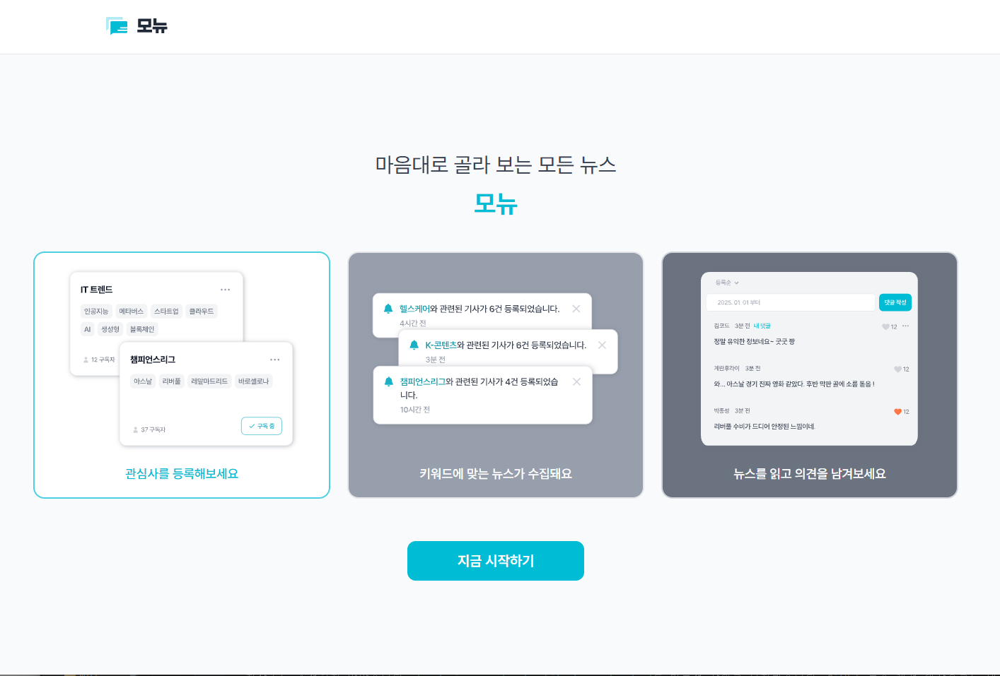

# Monew

[](https://codecov.io/gh/y2ahhh/sb13-monew-team04/tree/develop)
[](https://codecov.io/gh/y2ahhh/sb13-monew-team04/tree/main)

> 마음대로 골라 보는 모든 뉴스

Monew는 여러 뉴스 제공처의 기사를 한곳에 모으고, 사용자가 관심 있는 주제의 뉴스와 활동을 쉽게 확인할 수 있도록 만든 서비스입니다. 관심사 구독, 기사 조회, 댓글과 좋아요, 알림, 활동내역을 함께 제공합니다.

<p align="center">
  
</p>

<p align="center">
  <a href="#프로젝트-소개">프로젝트 소개</a> ·
  <a href="#서비스-이용-흐름">서비스 이용 흐름</a> ·
  <a href="#주요-기능">주요 기능</a> ·
  <a href="#기술적-문제-해결">기술적 문제 해결</a> ·
  <a href="#로컬-실행">로컬 실행</a>
</p>

| 바로가기 | 링크 |
| --- | --- |
| 운영 서비스 | [https://boxbox.kr/](https://boxbox.kr/) |
| API 문서(Swagger) | [https://boxbox.kr/swagger-ui/index.html](https://boxbox.kr/swagger-ui/index.html) |
| 팀 협업 기록 | [Monew 팀 협업 기록](https://rndud2208.atlassian.net/wiki/external/MWQ5ZTljYmEyN2ZiNDZkMGI1ODA1M2NiMWFlZGY1ZDE) |
| 결과와 회고 | [프로젝트 결과와 회고](https://rndud2208.atlassian.net/wiki/external/NzVkZDIyNjRkOWRkNGI3M2ExODYyY2VkMjJkYWQ2MTQ) |

## 프로젝트 소개

- 프로젝트 기간: 2026.08.12 ~ 2026.09.04
- 팀 이름: Monew
- 주요 목표: 여러 뉴스 제공처의 기사를 수집하고, 관심사에 맞는 뉴스와 사용자 활동을 하나의 서비스에서 제공

## 서비스 이용 흐름

| 순서 | 사용자가 경험하는 과정 |
| ---: | --- |
| 1 | 회원가입과 로그인 후 관심 있는 주제와 키워드를 등록합니다. |
| 2 | 원하는 관심사를 구독하면 여러 뉴스 제공처에서 관련 기사를 수집합니다. |
| 3 | 새 기사를 알림으로 확인하고 기사를 읽거나 댓글과 좋아요로 의견을 나눕니다. |
| 4 | 활동내역에서 구독한 관심사와 최근 댓글·좋아요·조회 기사를 다시 확인합니다. |

## 주요 기능

| 영역 | 쉬운 설명 |
| --- | --- |
| 사용자 | 회원가입과 로그인, 내 정보 수정, 회원 탈퇴를 처리합니다. 삭제 후 일정 기간이 지나면 정보를 정리하는 기능도 제공합니다. |
| 관심사 | 관심사와 키워드를 등록하고 비슷한 이름을 확인하며, 원하는 관심사를 구독하거나 해제할 수 있습니다. |
| 뉴스 기사 | 외부 뉴스 API와 RSS에서 기사를 수집하고 검색·정렬·페이지 이동(페이지네이션)을 제공합니다. 조회 기록과 기사 백업·복구도 관리합니다. |
| 댓글·좋아요 | 기사에 댓글을 작성·수정·삭제하고 댓글에 좋아요를 남길 수 있습니다. 같은 사용자의 중복 좋아요를 막습니다. |
| 알림 | 구독한 관심사의 새 기사와 내 댓글의 좋아요 소식을 알려 줍니다. 읽지 않은 알림 조회, 확인, 오래된 알림 정리를 지원합니다. |
| 활동내역 | 내가 구독한 관심사, 최근 작성한 댓글, 좋아요를 누른 댓글, 최근 본 기사를 한 번에 확인할 수 있습니다. |

## 기술적 문제 해결

### 서로 다른 뉴스 제공처를 하나의 방식으로 수집

- **문제:** NAVER 뉴스 API와 언론사 RSS는 요청 방법과 응답 형식이 서로 달라, 출처마다 수집 흐름이 달라질 수 있었습니다.
- **해결:** 모든 출처가 공통 수집 계약(`NewsSourceAdapter`)을 따르게 하고, NAVER·한국경제·조선일보·연합뉴스TV별 어댑터가 차이를 처리하도록 나눴습니다.
- **의미:** 수집 작업은 등록된 어댑터를 같은 방식으로 실행하므로 새로운 뉴스 제공처를 추가할 때 기존 수집 흐름의 변경을 줄일 수 있습니다.
- **근거:** [뉴스 수집 어댑터 사용 가이드](docs/mid4-151-news-source-adapter-usage-guide.md)

### 유실된 기사를 위한 날짜별 S3 백업과 복구

- **문제:** 물리적으로 삭제된 기사를 복구할 수 있어야 하고, 여러 서버가 같은 백업을 동시에 실행하거나 기존 파일을 덮어쓰는 상황도 막아야 했습니다.
- **해결:** 기사를 날짜별 JSON으로 S3에 저장하고, 조건부 저장(`saveIfAbsent`)과 PostgreSQL 작업 잠금(advisory lock)으로 덮어쓰기와 중복 실행을 방지했습니다.
- **의미:** 지정한 날짜 범위의 백업에서 현재 DB에 없는 기사만 확인해 복구할 수 있습니다.
- **근거:** [뉴스 기사 S3 백업 및 복구 기준](docs/mid4-148-article-s3-backup-restore.md)

### 측정 결과를 근거로 활동내역 조회 개선

- **문제:** 데이터가 늘어나자 최근 활동을 찾는 SQL이 넓은 범위를 읽고, 결과마다 개수를 다시 계산하면서 조회 시간이 증가했습니다.
- **해결:** 실행계획(`EXPLAIN`)과 부하 테스트(k6)로 병목을 확인한 뒤 조회 조건에 맞는 인덱스와 노출 상태(`visibility_status`)를 적용했습니다.
- **결과:** 문서화한 장시간 테스트에서 `190 RPS`를 30분 동안 처리했으며 p95는 `37.29ms`, p99는 `52.11ms`였습니다. 이 값은 해당 테스트 환경의 결과이며 운영 성능 보장값은 아닙니다.
- **근거:** [활동내역 조회 성능 개선 기록 안내서](docs/activity-history-performance-guide.md)

### 작은 운영 서버에서도 반복 가능한 배포

- **문제:** 애플리케이션과 PostgreSQL을 함께 운영하는 EC2에서 매번 프로젝트를 직접 빌드하면 서버 자원이 부족해질 수 있었습니다.
- **해결:** GitHub Actions가 Docker 이미지를 빌드해 이미지 저장소(GHCR)에 올리고, EC2는 완성된 이미지만 내려받도록 구성했습니다. 외부 요청은 Nginx와 HTTPS 인증서(Let's Encrypt)를 거쳐 전달됩니다.
- **의미:** 운영 서버의 빌드 부담을 줄이고 같은 이미지로 반복 배포할 수 있습니다.
- **근거:** [EC2 배포 가이드](docs/ec2-deployment-guide.md)

## 팀원과 담당 기능

| 팀원 | 담당 영역 | 대표 구현 | GitHub |
| --- | --- | --- | --- |
| 장준서 | 사용자 관리 | 회원가입·로그인, 정보 수정, 회원 삭제와 요청 사용자 식별 | [jangjunseo518-collab](https://github.com/jangjunseo518-collab) |
| 함지원 | 관심사 관리 | 관심사·키워드 관리, 비슷한 이름 검증, 검색과 구독·해제 | [HamJiWeon](https://github.com/HamJiWeon) |
| 김두호 | 뉴스 기사 관리 | 기사 검색·정렬·페이지 이동, 조회 기록과 기사 삭제 | [dooho9767](https://github.com/dooho9767) |
| 최진희 | 댓글·좋아요 관리 | 댓글 작성·조회·수정·삭제, 좋아요·취소와 중복 방지 | [hisjeans](https://github.com/hisjeans) |
| 정구영 | 활동내역·뉴스 수집 지원 | 활동내역 통합 조회와 관계형 데이터베이스(RDB) 성능 개선, RSS 수집 어댑터와 S3 백업·복구 | [KooYeoung](https://github.com/KooYeoung) |
| 이예은 | 알림 관리 | 관심사 기사·댓글 좋아요 알림, 미확인 조회·확인과 오래된 알림 정리 | [y2ahhh](https://github.com/y2ahhh) |

## 기술 구성

| 구분 | 사용 기술 |
| --- | --- |
| 언어·빌드 | Java 17, Gradle |
| 애플리케이션 | Spring Boot 4.1.0, Spring Web MVC, Bean Validation |
| 데이터 | PostgreSQL, Spring Data JPA, QueryDSL, Flyway |
| 테스트 | JUnit Jupiter, Spring Boot Test, Mockito, AssertJ, H2 |
| API 문서 | Swagger UI, OpenAPI |
| 외부 연동 | NAVER 뉴스 검색 API, RSS, AWS S3 |
| 개발 환경 | Docker Compose |
| 품질·자동화 | GitHub Actions, JaCoCo, Codecov |
| 운영 | AWS EC2, Docker Compose, GHCR, Nginx, Let's Encrypt |

## 프로젝트 구조

기능 영역(도메인)별로 코드를 나누고, 여러 영역에서 함께 사용하는 설정과 예외 처리는 `global`에 모았습니다.

```text
src/main/java/com/codeit/sb13/monew
├── activity       # 활동내역
├── article        # 뉴스 기사·수집·백업
├── comment        # 댓글·좋아요
├── interest       # 관심사·구독
├── notification   # 알림
├── user           # 사용자
└── global         # 공통 설정·예외·응답 처리
```

## 로컬 실행

### 준비 사항

- Java 17
- Docker Desktop 또는 로컬 PostgreSQL 16

저장소를 내려받고 프로젝트 디렉터리로 이동합니다.

```bash
git clone https://github.com/y2ahhh/sb13-monew-team04.git
cd sb13-monew-team04
```

개인 설정 파일은 공유 예시 파일인 `.env.example`을 복사해 만듭니다. 실제 비밀번호와 API 인증값이 들어가는 `.env.dev`는 Git에 올리지 않습니다.

Windows PowerShell:

```powershell
Copy-Item .env.example .env.dev
.\gradlew.bat bootRun
```

Mac, Linux, Git Bash:

```bash
cp .env.example .env.dev
./gradlew bootRun
```

기본 설정에서는 Spring Boot가 `compose.yaml`을 이용해 PostgreSQL 컨테이너를 함께 실행합니다. Docker를 사용하지 않는다면 `.env.dev`의 `MONEW_DOCKER_COMPOSE_ENABLED`를 `false`로 바꾸고 PostgreSQL을 직접 실행해야 합니다.

기본 접속 주소는 다음과 같습니다.

- 서비스: [http://localhost:8080](http://localhost:8080)
- Swagger UI: [http://localhost:8080/swagger-ui.html](http://localhost:8080/swagger-ui.html)

환경변수와 외부 뉴스 API 설정은 [환경 설정 방법](docs/environment-setup.md)에서 자세히 확인할 수 있습니다.

## 테스트

테스트는 `test` 프로필과 메모리 데이터베이스(H2)를 사용하므로 PostgreSQL을 별도로 실행하지 않아도 됩니다. 실제 외부 API를 호출하는 테스트는 기본 테스트에서 제외됩니다.

Windows:

```powershell
.\gradlew.bat test
.\gradlew.bat clean build
```

Mac, Linux, Git Bash:

```bash
./gradlew test
./gradlew clean build
```
